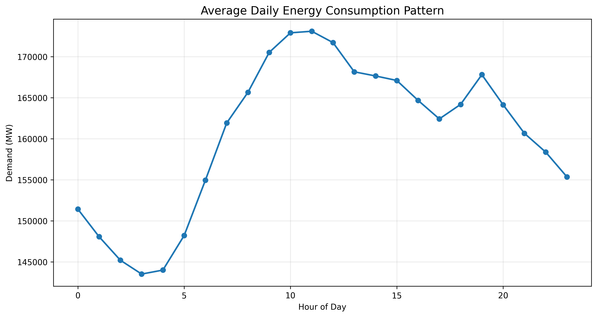
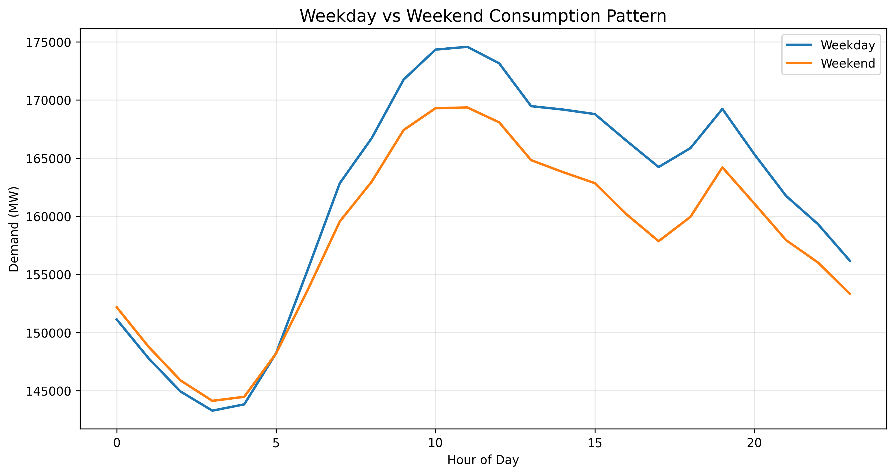
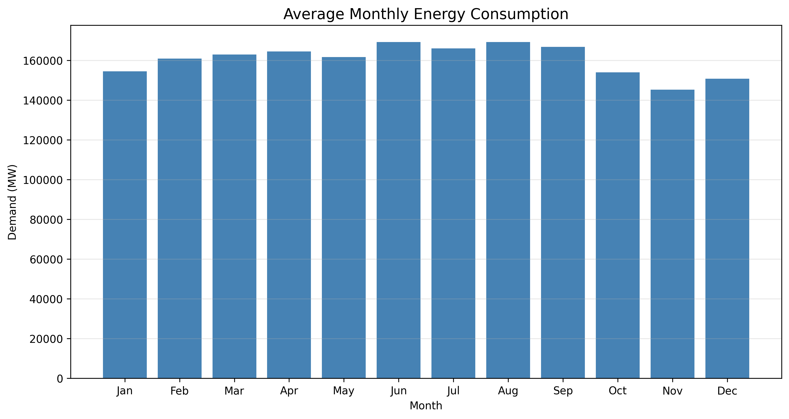
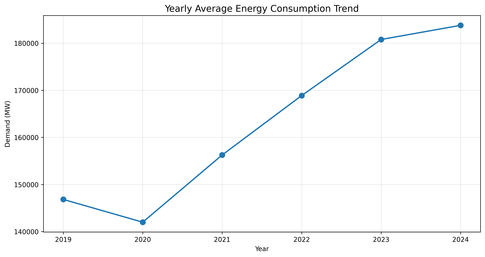

# energy-consumption-forecaster
Time-series analysis and forecasting of Indian energy consumption using SARIMA, Random Forest, and LSTM models
# ⚡ Energy Consumption Forecaster - India

## 📊 Project Overview

A comprehensive time-series analysis and forecasting project for Indian energy consumption patterns using **46,728 hourly records** from January 2019 to April 2024.

### 🎯 Objective
- Analyze energy usage patterns across different time scales
- Build and compare multiple forecasting models
- Identify seasonal trends and peak demand periods
- Provide actionable insights for energy management

### 🏆 Key Results
| Model | MAE (MW) | RMSE (MW) | MAPE (%) |
|-------|----------|-----------|----------|
| **Random Forest** | **X,XXX** | **X,XXX** | **X.XX%** |
| LSTM | X,XXX | X,XXX | X.XX% |
| SARIMA | X,XXX | X,XXX | X.XX% |

---

## 📈 Key Findings

### Daily Patterns
- **Peak Demand**: 7:00 PM (179,000 MW)
- **Off-Peak**: 4:00 AM (151,000 MW)
- **Pattern**: Morning (9 AM) and evening (7 PM) peaks

### Weekly Patterns
- **Weekday Average**: 161,212 MW
- **Weekend Average**: 158,525 MW
- **Difference**: 2,687 MW lower on weekends

### Seasonal Patterns
| Season | Average Demand |
|--------|----------------|
| Summer (Mar-May) | 168,297 MW |
| Post-Monsoon (Oct-Nov) | 164,748 MW |
| Monsoon (Jun-Sep) | 158,570 MW |
| Winter (Dec-Feb) | 149,782 MW |

### Yearly Trends
- **2019-2023 Growth**: 24.4% increase
- **Peak Year**: 2023 (179,671 MW)

---

## 🏗️ Project Structure
energy-consumption-forecaster/
│
├── energy_forecaster.ipynb # Complete analysis notebook
├── README.md # Project documentation
├── requirements.txt # Python dependencies
│
├── images/ # Visualizations
│ ├── daily_pattern.png
│ ├── weekly_pattern.png
│ ├── seasonal_pattern.png
│ ├── heatmap.png
│ └── model_comparison.png
│
├── results/ # Output files
│ └── model_performance.csv
│
└── data/ # Dataset (link only)
└── README.md

## 📊 Visualizations

### Daily Pattern

### Weekday vs Weekend

### Monthly Pattern

### Yearly Trend

### Heatmap

### Model Comparison

